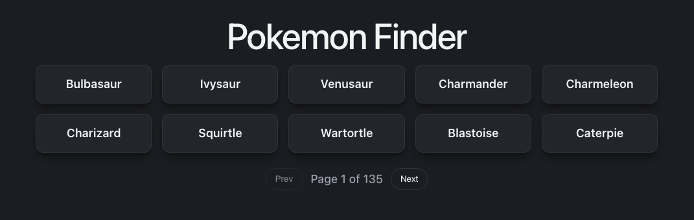
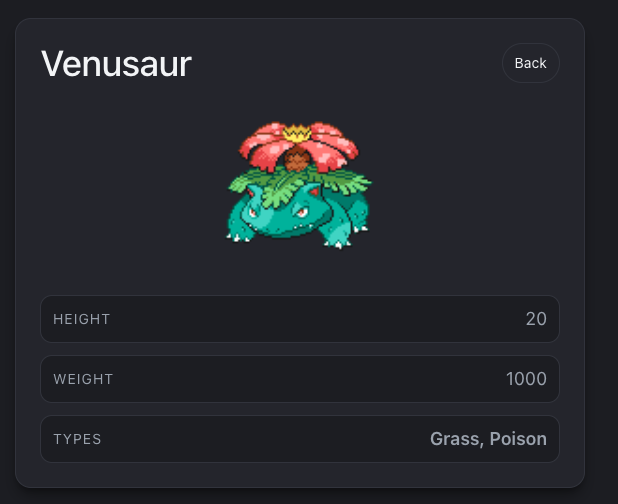

# Pokemon Finder

A small React app that lists Pokemon from the PokeAPI and lets you view details.

## Features

- Paginated list (10 per page)
- Detail page with extra info per pokemon (using the pokemon id)

## Screenshots

Add your images here.

- Home page: 
- Detail page: 

## Using the application

1. Install dependencies: `npm install`
2. Start dev server: `npm run dev`

